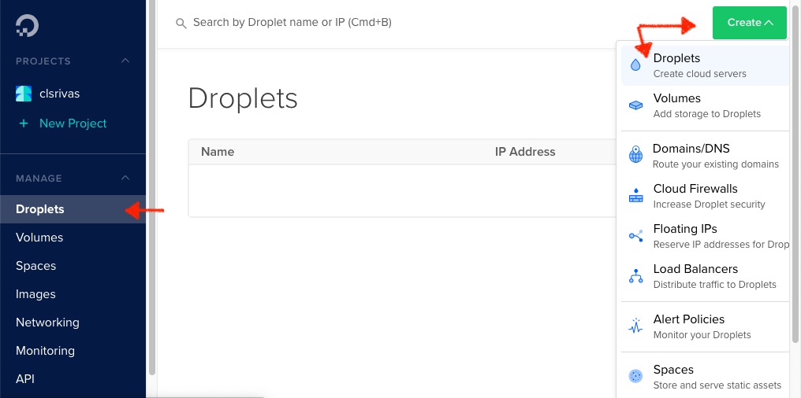
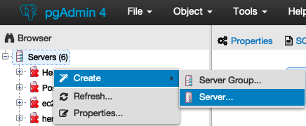
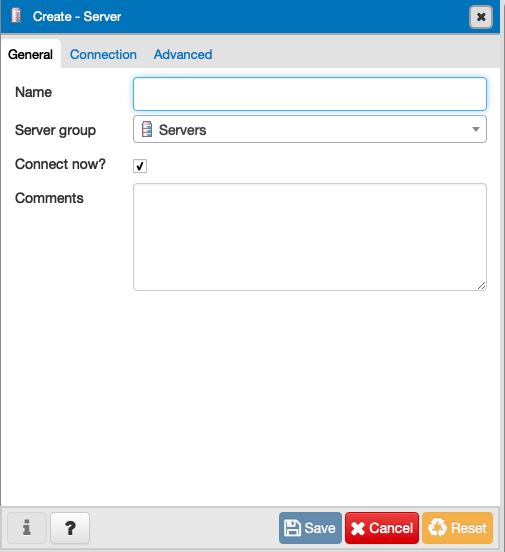
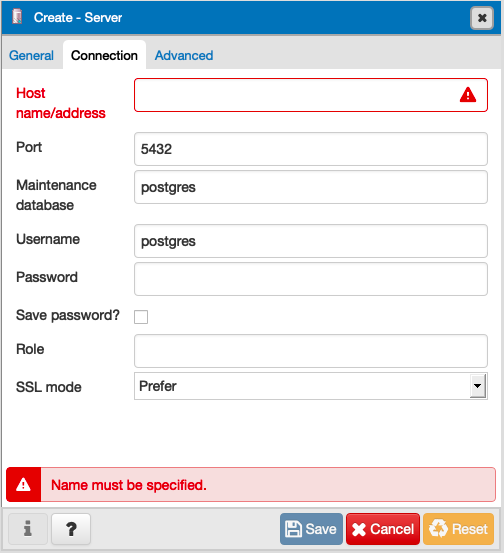

# Agregar una base de datos PostgreSQL para tus proyectos en la nube con DigitalOcean
Autor: Claudio Rivas

Fecha: 4 de noviembre de 2018

## Aviso de exclusión de garantías y responsabilidad 

La información provista en este documento no constituye una responsabilidad para el autor ni para los entes mencionados, por lo cual deberá ser utilizado a discreción del lector bajo su propio riesgo.

La utilización de plataformas en la nube generalmente implica un costo, por lo cual es necesario revisar dichos costos con los proveedores de servicios, los cuales por ninguna razón son transferibles al autor.


DigitalOcean no patrocina al autor de este documento.

## Sugerencia

Sigue las actividades de la tabla de contenido, están puestas en orden para realizar toda la configuración de manera ordenada.

## Contenido

[Introducción](#introduccion)

[Generar un Droplet en DigitalOcean con Centos](#generar-un-droplet-en-digitalocean-con-centos)

[Conectar al servidor mediante SSH](#conectar-al-servidor-mediante-ssh)

[Instalar postgreSQL](#instalar-postgresql)

[Crear usuario en Linux](#crear-usuario-en-linux)

[Crear rol de PostgreSQL medainte createuser](#crear-rol-de-postgresql-medainte-createuser)

[Cambiar password de usuario en PostgreSQL](#cambiar-password-de-usuario-en-postgresql)

[Permitir conexiones desde cualquier host](#permitir-conexiones-desde-cualquier-host)

[Conectar pgAdmin](#conectar-pgadmin)

## Introducción

Nuestras aplicaciones generalmente requieren de la persistencia de datos a través del tiempo, una forma utilizada comúnmente es a través de una base de datos, ya que nos permite organizar la información y recuperarla a través de consultas a la base de datos conocidas como **queries**, si estás en este blog seguramente ya sabes a lo que me refiero, así que vamos al grano.

DigitalOcean es un servicio de cómputo en la nube, es decir te proporciona los servicios similar a Google Cloud, AWS o Azure. Una vez que lo utilices querrás generar una base de datos para agregar persistencia de los mismos a tu aplicación.
DigitalOcean ofrece diversas distros de sistemas operativos y permite instalar algunas aplicaciones de forma predeterminada en base a instancias conocidas como **Droplets**, estos droplets son tus servidores virtuales, en los cuales puedes instalar tu servidor Linux de forma ágil y sobre este montar tu base de datos Postgres.

Para este caso utilizaremos un servidor **Centos 7.5** y sobre este instalaremos nuestra base de datos **PostgreSQL 9.2.24**, ya que son las que se encuentran disponibles por el momento.
**Las plataformas en la nube tienen un costo por uso, por esta razón te sugerimos revisar muy bien los costos y los alcances con el proveedor del servicio**.

## Generar un Droplet en DigitalOcean con Centos

Si no tienes una cuenta de DigitalOcean te recomiendo utilizar mi enlace de referidos [Referidos DigitalOcean https://m.do.co/c/b8a3fc9a0a00](https://m.do.co/c/b8a3fc9a0a00)

1.- Una vez que inicies sesión en DigitalOcean selecciona del menú **MANAGE** la opción **Droplets**.

2.- Presiona el botón **Create^** y selecciona la opción **Droplets**
.

3.- Selecciona del menú **Distributions** la opción **CentOS**
.

4.- En la opción **Choose a size** selecciona el tamaño del hardware de tu **Droplet** basado en los recursos que necesites dedicados. Se cuidadoso ya que se generan cargos por el uso implicando directamente un precio, si estás solamente probando te aconsejamos seleccionar el más pequeño y de menor costo.

5.- Selecciona **no** en la opción **Add backups** la opción que deseas, tampoco es necesario que agregues volúmenes adicionales en la opción **Add block storage** (para esta guía ninguna de estas opciones son requeridos salvo que identifiques necesidades particulares).

6.- Del menú **Choose a datacenter region** selecciona la región más acorde para tu **Droplet**

7.- Del menú **Select additional options** puedes dejarlos como están (para esta guía no son requeridas salvo que identifiques necesidades particulares) al igual que la opción **Add your SSH keys** (para esta guía ninguna de estas opciones son requeridas salvo que identifiques necesidades particulares).

8.- En la opción **Finalize and create** verifica que solo tengas 1 Droplet seleccionado en el control y puedes cambiar el hostname de tu droplet.

9.- Por último presiona el botón **Create**.

10.- Verás una barra de progreso, al finalizar recibirás un correo en la dirección de email indicado en tu cuenta el cual incluye credenciales de acceso y la dirección IP que te fue asignada, esta contraseña debe ser cambiada ya que es de un solo uso, lo recomendable es hacerlo a través de una conexión **SSH** ya que la consola del **Droplet** en web se cierra muy rápidamente.

## Conectar al servidor mediante SSH

Para esto utilizaremos la terminal de OSX, si estás utilizando Windows puedes utilizar el programa **Putty**.

1.- Abre una nueva terminal.

2.- En la terminal utiliza el comando SSH para conectarte a tu servidor:

```
ssh root@ip_del_servidor
```

No olvides sustituir **username** por el nombre de usuario que hayas escogido e **ip_del_servidor** por la dirección IP del servidor que te indicaron en el correo que recibiste de DigitalOcean.

3.- Solo la primera vez que te conectes verás que aparece el mensaje, ```Are you sure you want to continue connecting (yes/no)? ``` indica ```yes``` para aceptar que quieres conectarte.

4.- Verás el prompt de la terminal indicando, te solicitarán ingresar nuevamente la contraseña y cambiarla, al finalizar observaras el prompt con el usuario **root** en **server**:

```
[root@server ~]$ 
```

No olvides que puedes utilizar este método para conectarte por SSH con otros usuarios distintos a **root** siempre y cuando tengas los permisos correctos.

## Instalar postgreSQL
Para instalar **PostgreSQL** es necesario iniciar sesión en la consola del servidor, el usuario predeterminado generado durante la creación de la instancia de Centos es **root**.

1.- Instalar **PostgreSQL**:
```
sudo yum install postgresql-server postgresql-contrib
```

2.- Crear un cluster de **PostgreSQL**:

```
sudo postgresql-setup initdb
```
3.- Instalar nano (porque vi es más difícil):
```
sudo yum install nano
```
4.- Editar el archivo pg_hba.conf con el editor **nano** para modificar el cifrado a md5:

```
sudo nano /var/lib/pgsql/data/pg_hba.conf
```

5.- Buscar las líneas:

```
host    all             all             127.0.0.1/32            ident
host    all             all             ::1/128                 ident
```

6.- Cambiarlas para que indiquen la utilización de **md5**:

```
host    all             all             127.0.0.1/32            md5
host    all             all             ::1/128                 md5
```
7.- Salvar el archivo presionando **Ctrl+X** y confirmando los cambios.

8.- Arrancar los servicios de Postgres:

```
[username@server ~]# sudo systemctl start postgresql
[username@server ~]# sudo systemctl enable portgresql
```

Hasta este punto, **PostgreSQL** ya se encuentra instalado en tu servidor Linux.


## Crear usuario en Linux
El usuario **posgres** es generado de forma automática, sin embargo no se recomienda el uso de este usuario para generar conexiones ya que cuenta con privilegios altos, para una mejor referencia consulte la [Documentación de PosgreSQL](https://www.postgresql.org/docs/9.3/static/app-createuser.html).

La forma en que se configura **PostgreSQL** de manera predeterminada (los roles de autenticación solicitados por las cuentas del sistema coincidentes) también se da por supuesto que existirá una base de datos coincidente para el rol al que se conectará.

```
[root@server ~]$adduser username
[root@server ~]$passwd username
```

## Crear rol de PostgreSQL medainte createuser

Conforme se especifica en la [Documentación de PosgreSQL](https://www.postgresql.org/docs/9.3/static/app-createuser.html), **createuser** crea un nuevo usuario de **PostgreSQL** (o más precisamente, un rol). Solo los superusuarios y los usuarios con el privilegio **CREATEROLE** pueden crear nuevos usuarios, por lo que el usuario debe invocar createuser como un superusuario o un usuario con el privilegio **CREATEROLE**.
````--interactive```` Solicita un nombre de usuario (user name) si no es especificado en la línea de comandos. 

1.- Inicia sesión con tu usuario de Linux que generaste en el paso anterior, puedes seguir los pasos en [Conectar al servidor mediante SSH](#conectar-al-servidor-mediante-ssh) , solamente no olvides cambiar **root** por el nombre de tu usuario.

2.- Inicia **psql**

```
[username@server ~]$ psql
```

3.- Ingresa el comando:

```
username=# createuser --interactive
```

4.- Da el nombre del usuario y completa lo que te pide en el cursor.

5.- Sal de psql:

```
username=# \q
```

## Cambiar password de usuario en PostgreSQL
Iniciar sesión con el usuario de **Linux** que generamos previamente.

1.- Abrir **psql**:

```
[username@server ~]$psql
```
2.- Modificar la contraseña:

```
username=# \password username
Enter new password:
Enter it again:
```

3.- Salir de **psql**:

```
username=# \q
[username@server ~]$
```

## Permitir conexiones desde cualquier host
Durante la etapa de desarrollo o pruebas es común que necesites acceder directamente a la base de datos, para ello es necesario configurar el servidor para aceptar conexiones de múltiples puntos desde diversas direcciones IP, esto agrega un punto vulnerable, por lo cual no es aconsejable para entornos de producción.
Para realizar esto es necesario configurar los archivos ```pg_hba.conf``` y ```postgresql.conf```.

### Modificar el archivo pg_hba.conf

1.- Abrir el archivo ```pg_hba.conf``` con el editor **nano**.

```
sudo nano /var/lib/pgsql/data/pg_hba.conf
```
2.- Agregar al final la línea.

```
host    all             all             0.0.0.0/0               md5
```
3.- Salvar el archivo presionando **Ctrl+X** y confirmando los cambios.

### Modificar el archivo postgresql.conf 
1.- Abrir el archivo ```postgresql.conf``` con el editor **nano**:

```
sudo nano /var/lib/pgsql/data/postgresql.conf
```
2.- Identificar el apartado: ```# CONNECTIONS AND AUTHENTICATION```

Agregar la línea:

```
listen_addresses = '*'
```
3.- Salvar el archivo presionando **Ctrl+X** y confirmando los cambios

### Reiniciar el servicio de postgres:

```
[username@server ~]# sudo systemctl start postgresql
[username@server ~]# sudo systemctl enable postgresql
```

## Conectar pgAdmin
Comúnmente utilizamos una aplicación a modo de gestor, esto nos permite visualizar la base de datos de forma directa, la aplicación que utilizaremos es **pgAdmin**, puedes descargarlo de [https://pgadmin.org](https://www.pgadmin.org/).

1.- Abre **pgAdmin**.

2.- Da click derecho al menu **Servers** y selecciona **Create > Server...**



3.- En la pestaña general ingresa el nombre con el que quieres identificar en la lista de Browser a tu servidor de **PostgreSQL**:



4.- En la pestaña Conexión deberás especificar los parámetros de tu servidor:



- **Hostname/address:** El nombre o dirección IP del servidor de **PostgreSQL**.

- **Port:** El puerto, por defecto **PostgreSQL** trabaja con el puerto 5432, por lo cual si no lo cambiaste en tu servidor te sugerimos dejar el mismo.

- **Maintenance database:** La base de datos que se generó con el Rol de **PostgreSQL** que generaste.

- **Username:** El rol de **PostgreSQL** que generaste previamente.

- **Password:** La contraseña del rol de **PostgreSQL**.

- **Save password?** Si deseas no volver a escribir la contraseña para este servidor una vez que abras **pgAdmin**  selecciona esta opción.

- **Role:** Si tu rol y tu username es el mismo puedes dejar este campo en blanco.
SSL mode: Prefer está bien.

## Programa de referidos de DigitalOcean

Para apoyarme te dejo mi link de referencia de DigitalOcean en caso que quieras abrir una cuenta, con esto una vez que consumas $25 USD incrementarán $25 USD a mi cuenta de DigitalOcean:

[Referidos DigitalOcean https://m.do.co/c/b8a3fc9a0a00](https://m.do.co/c/b8a3fc9a0a00)
